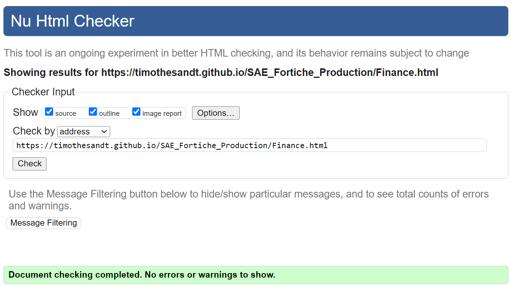
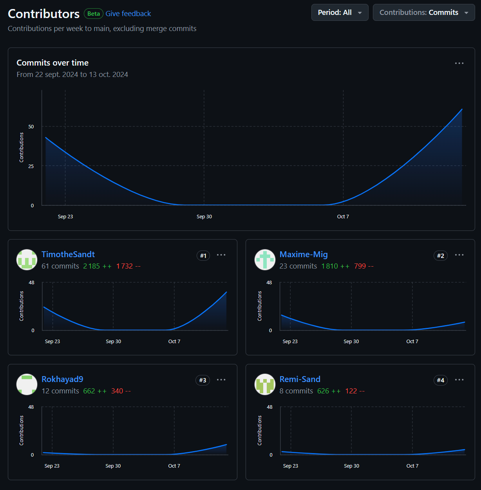

# SAE - Fortiche Production
projet en cours de réalisation

## Sujet

[SAE_Fortiche_Production](https://timothesandt.github.io/SAE_Fortiche_Production/)  
Pour notre 1ère année au BUT Informatique de Belfort, nous devons réaliser un projet SAE afin de présenter une entreprise du numérique Française.  

## Présentation du projet

présentation du projet  
Ce projet consiste à créer un site web pour une entreprise du numérique, Fortiche Production, qui est un studio d'animation 3D/2D qui a gagné en notoriété en réalisant des animations de qualité pour des entreprises comme Riot Games.  
Le site web est composé de cinq pages : une page d'accueil, une page "histoire" qui retrace l'histoire de l'entreprise, une page "à propos" qui nous parle de l'entreprise en elle même, une page "projet" qui présente les projets que l'entreprise a pu faire et enfin une page "finance" qui nous parle de la situation financière de l'entreprise.  

## Membres du groupe

Ce projet est réaliser par **Timothé SANDT**, **Maxime MIGUET**, **Rémi SANDRONE**, **Rokhaya Diallo**  
Groupe **16**  
Référent Timothé Sandt - *timothe.sandt@edu.univ-fcomte.fr*  

## Répartition du travail - site

### Page d'accueil

Page [d'accueil]() - Rémi aidé par le reste de groupe 
 
Vérification W3C : [Détail ICI](https://validator.w3.org/nu/?showsource=yes&showoutline=yes&showimagereport=yes&doc=https%3A%2F%2Ftimothesandt.github.io%2FSAE_Fortiche_Production%2Findex.html)
 

 
Vérification ecoindex : [Détail ICI](https://www.ecoindex.fr/resultat/?id=8f88570f-83f4-4835-bbc2-f39ca8850932#score-details)
 

 

### Page histoire

Page [histoire](https://timothesandt.github.io/SAE_Fortiche_Production/histoire.html) - Rokhaya 
 
Vérification W3C : [Détail ICI](https://validator.w3.org/nu/?showsource=yes&showoutline=yes&showimagereport=yes&doc=https%3A%2F%2Ftimothesandt.github.io%2FSAE_Fortiche_Production%2Fhistoire.html)
 

 
Vérification ecoindex : [Détail ICI](https://www.ecoindex.fr/resultat/?id=14b04543-147a-4432-915d-96ad9f26bf8f)
 

 

### Page projet

Page [projet](https://timothesandt.github.io/SAE_Fortiche_Production/projet.html) - Timothé 
 
Vérification W3C : [Détail ICI](https://validator.w3.org/nu/?showsource=yes&showoutline=yes&showimagereport=yes&doc=https%3A%2F%2Ftimothesandt.github.io%2FSAE_Fortiche_Production%2Fprojet.html)
 

 
Vérification ecoindex : [Détail ICI](https://www.ecoindex.fr/resultat/?id=c9c12fcc-bf2c-4036-800c-83db9c275909)
 

 

### Page Finance

Page [finance](https://timothesandt.github.io/SAE_Fortiche_Production/Finance.html) - Maxime 
 
Vérification W3C : [Détail ICI](https://validator.w3.org/nu/?showsource=yes&showoutline=yes&showimagereport=yes&doc=https%3A%2F%2Ftimothesandt.github.io%2FSAE_Fortiche_Production%2FFinance.html)
 

 
Vérification ecoindex : [Détail ICI](https://www.ecoindex.fr/resultat/?id=bc02fcb0-c7f7-4f8a-84fc-fb0c3178d454)
 

 

### Page à propos

Page [à propos](https://timothesandt.github.io/SAE_Fortiche_Production/A_propos.html) - Rémi 
 
Vérification W3C : [Détail ICI](https://validator.w3.org/nu/?showsource=yes&showoutline=yes&showimagereport=yes&doc=https%3A%2F%2Ftimothesandt.github.io%2FSAE_Fortiche_Production%2FA_propos.html)
 

 
Vérification ecoindex : [Détail ICI](https://www.ecoindex.fr/resultat/?id=bf6665f7-6b28-46a1-a313-168706f3684f)
 

 

## Répartition du travail 

### Planification - Diagramme de GANTT

Timothe Sandt  

### Rapport

Timothe Sandt  
Maxime Miguet  
Remi Sandrone  
Rokhaya Diallo  

### Questionnaire

Questionnaire 1 - Timothé et Maxime aidé par le reste du groupe 
Questionnaire 2 - Timothé et Maxime aidé par le reste du groupe 
Zooning/Wireframe - Maxime - Rémi 
Style tiles - Maxime 

## Contributeurs

